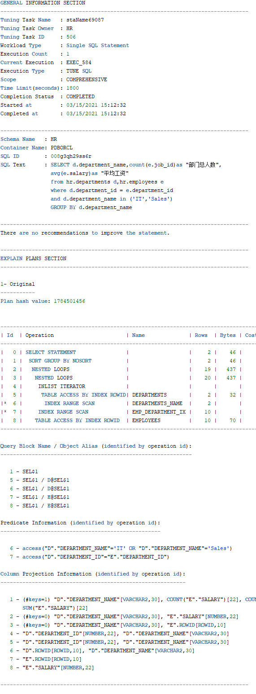

# 实验1：SQL语句的执行计划分析与优化指导


## 姓名：刘凌      学号：201810414314


## 实验目的：

​	分析SQL执行计划，执行SQL语句的优化指导。理解分析SQL语句的执行计划的重要作用。


## 实验内容：

- 对Oracle12c中的HR人力资源管理系统中的表进行查询与分析。
- 首先运行和分析教材中的样例：本训练任务目的是查询两个部门('IT'和'Sales')的部门总人数和平均工资，以下两个查询的结果是一样的。但效率不相同。
- 设计自己的查询语句，并作相应的分析，查询语句不能太简单。


## 查询代码：

### 查询一：

```sql
set autotrace on

SELECT d.department_name,count(e.job_id)as "部门总人数",
avg(e.salary)as "平均工资"
from hr.departments d,hr.employees e
where d.department_id = e.department_id
and d.department_name in ('IT','Sales')
GROUP BY d.department_name;
```

### 查询结果：

执行结果：


执行结果：




优化指导：


### 查询二：

```sql
set autotrace on

SELECT d.department_name,count(e.job_id)as "部门总人数",
avg(e.salary)as "平均工资"
FROM hr.departments d,hr.employees e
WHERE d.department_id = e.department_id
GROUP BY d.department_name
HAVING d.department_name in ('IT','Sales');
```

### 查询结果：

执行结果：


执行结果：


优化指导：


### 查询三：

```
SELECT a.department_name,count(e.job_id)as "部门总人数",avg(e.salary)as "平均工资"
from (SELECT department_id,department_name 
      from HR.departments 
      WHERE department_name in ('IT','Sales')) a,hr.employees e
WHERE a.department_id=e.department_id
GROUP BY a.department_name
```

### 查询结果：

执行结果：


优化指导：


## 实验总结：

两条运行结果相比较，发现SQL2耗时更长，效率更低。原因是SQL1筛选出了结果再进行Select出结果，而sql2没有这么灵活。所以语句1是最优的，
