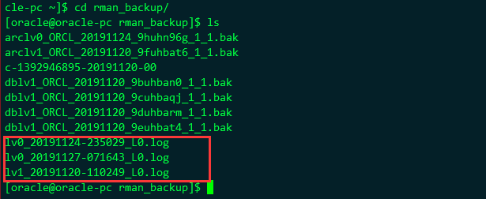

### 姓名：刘凌   学号：201810414314


# 图书管理系统数据设计

## 一、引言
图书管理系统是为了给图书管理人员和读者借、还书带来便利。除了图书馆内管理的一般功能还外，还包括网上在线查询图书信息、查询本人的借阅情况等功能。目标还包括:减少人力与管理费用;提高信息准确度;改进管理和服务;建立高效的信息传输和服务平台，提高信息处理速度和利用率。所以图书管理系统应该具有高并发性和高性能的系统。数据库的设计也是在抗并发的解决措施里面，本数据库设计则是应用于此类图书管理系统中。
## 二、数据库设计
数据库中有6张表，分别是admin（管理员表），book_info（书籍信息表），class_info（书籍分类表），lend_list（读者借阅表），reader_card(读者借阅卡信息表)，reader_info(读者信息表)。

### 属性：
#### Book_info(书籍信息表)：

| 序号 | 字段名       | 字段含义           | 类型      | 长度   | 默认值 | 允许空 | 主键 |                     说明 |
| ---- | ------------ | ------------------ | --------- | ------ | ------ | ------ | ---- | -----------------------: |
| 1    | book_id      | 书籍数据库唯一标识 | number    | 20     |        |        | √    |                     自增 |
| 2    | name         | 书籍名称           | varchar   | 20     |        |        |      |                          |
| 3    | author       | 作者               | Varchar22 | 15     |        |        |      |                          |
| 4    | publish      | 出版社             | Varchar2  | 20     |        |        |      |                          |
| 5    | ISBN         | ISBN编号           | Varchar2  | 15     |        |        |      |                          |
| 6    | introduction | 书籍介绍           | blob      |        |        |        |      |                          |
| 7    | language     | 书籍语言           | Varchar2  | 4      |        |        |      |                          |
| 8    | price        | 书籍价格           | number    | (10,2) |        |        |      |                          |
| 9    | pub_date     | 出版时间           | date      |        |        |        |      |                          |
| 10   | class_id     | 类别唯一标识       | number    | 11     |        | √      |      | 外键class_info(class_id) |
| 11   | number       | 馆藏数量           | number    | 11     | 0      | √      |      |                          |

#### Admin(管理员表)：

| 序号 | 字段名   | 字段含义             | 类型     | 长度 | 默认值 | 允许空 | 主键 | 说明 |
| ---- | -------- | -------------------- | -------- | ---- | ------ | ------ | ---- | ---- |
| 1    | admin_id | 管理员数据库唯一标识 | number   | 20   |        |        | √    | 自增 |
| 2    | password | 密码                 | Varchar2 | 15   |        |        |      |      |
| 3    | username | 用户名               | Varchar2 | 15   |        |        |      |      |

 

#### Class_info(书籍分类表)：

| 序号 | 字段名     | 字段含义           | 类型     | 长度 | 默认值 | 允许空 | 主键 | 说明 |
| ---- | ---------- | ------------------ | -------- | ---- | ------ | ------ | ---- | ---- |
| 1    | class_id   | 类别数据库唯一标识 | number   | 11   |        |        | √    | 自增 |
| 2    | class_name | 书籍分类名称       | varchar2 | 15   |        |        |      |      |
| 3    | num        | 分类书籍总数量     | number   | 15   | 0      | √      |      |      |

 

#### Lend_list（读者借阅表）：

| 序号 | 字段名    | 字段含义       | 类型   | 长度 | 默认值 | 允许空 | 主键 | 说明 |
| ---- | --------- | -------------- | ------ | ---- | ------ | ------ | ---- | ---- |
| 1    | ser_num   | 数据库唯一标识 | number | 20   |        |        | √    | 自增 |
| 2    | book_id   | 书籍数据库标识 | number | 20   |        |        |      |      |
| 3    | reader_id | 读者数据库标识 | number | 20   |        |        |      |      |
| 4    | lend_date | 借出日期       | date   |      |        |        |      |      |
| 5    | back_date | 归还日期       | date   |      |        |        |      |      |

 

 

#### Reader_card(借阅卡信息表)：

| 序号 | 字段名    | 字段含义           | 类型     | 长度 | 默认值 | 允许空 | 主键 | 说明                       |
| ---- | --------- | ------------------ | -------- | ---- | ------ | ------ | ---- | -------------------------- |
| 1    | reader_id | 读者数据库唯一标识 | number   | 20   |        |        | √    | 外键reader_info(reader_id) |
| 2    | username  | 用户名             | varchar2 | 15   |        |        |      |                            |
| 3    | password  | 密码               | varchar2 | 15   |        |        |      |                            |

 

#### Reader_info(读者信息表)：

| 序号 | 字段名    | 字段含义           | 类型     | 长度 | 默认值 | 允许空 | 主键 | 说明 |
| ---- | --------- | ------------------ | -------- | ---- | ------ | ------ | ---- | ---- |
| 1    | reader_id | 读者数据库唯一标识 | number   | 20   |        |        | √    | 自增 |
| 2    | name      | 姓名               | Varchar2 | 10   |        |        |      |      |
| 3    | sex       | 性别               | Varchar2 | 2    |        |        |      |      |
| 4    | brith     | 生日               | date     |      |        |        |      |      |
| 5    | address   | 地址               | varchar2 | 50   |        |        |      |      |
| 6    | phone     | 电话号码           | varchar2 | 15   |        |        |      |      |

 

###  关联表：

读者借阅表是将书籍信息表和借阅卡信息表两张表关联起来的数据表。


书籍信息表是将书籍分类表关联。


借阅卡信息表是将读者信息表关联。

 

 

### 2. E-R图

简易的e-r图，如下：


 

## 三、表和数据添加

### 1、建表和插入数据

如下是本次数据库的建表sql，使用的是pl/sql语言写的一个文件。
在建表之前应该判断数据库中是否有该表的存在，如果有删除，如果没有，则执行建表语句。
这里使用的是查找该表中的数据条数，来判断是是否有表，然后执行drop table 来删除表。Declare表示申明，begin表示执行开始，需要在结尾加上end；/ 表示执行以上所有代码。
```sql
declare
      num   number;
begin
      select count(1) into num from user_tables where TABLE_NAME = 'admin';
      if   num=1   then
          execute immediate 'drop table admin cascade constraints PURGE';
      end   if;
      select count(1) into num from user_tables where TABLE_NAME = 'class_info';
      if   num=1   then
          execute immediate 'drop table class_info cascade constraints PURGE';
      end   if;
      select count(1) into num from user_tables where TABLE_NAME = 'book_info';
      if   num=1   then
          execute immediate 'drop table book_info cascade constraints PURGE';
      end   if;
      select count(1) into num from user_tables where TABLE_NAME = 'lend_list';
      if   num=1   then
          execute immediate 'drop table lend_list cascade constraints PURGE';
      end   if;
      select count(1) into num from user_tables where TABLE_NAME = 'reader_card';
      if   num=1   then
          execute immediate 'drop table reader_card cascade constraints PURGE';
      end   if;
      select count(1) into num from user_tables where TABLE_NAME = 'reader_info';
      if   num=1   then
          execute immediate 'drop table reader_info cascade constraints PURGE';
      end   if;
end;

/

```
以下是建表语句，根据数据字段的设计，在数据库中设计数据库表。
```sql
--创建admin 表
CREATE TABLE admin (
  admin_id NUMBER(6, 0) NOT NULL ,
  password VARCHAR2(16 BYTE) DEFAULT NULL,
  username VARCHAR2(64 BYTE) DEFAULT NULL
--  PRIMARY KEY (`admin_id`)
) ;

-- 创建book_info表
CREATE TABLE book_info(
book_id NUMBER(6,0) NOT NULL,
name VARCHAR2(20 BYTE) DEFAULT NULL,
author VARCHAR2(15 BYTE) DEFAULT NULL,
publish VARCHAR2(20 BYTE) DEFAULT NULL,
ISBN VARCHAR2(15 BYTE) DEFAULT NULL,
introduction CLOB DEFAULT NULL,
language VARCHAR2(4 BYTE) DEFAULT NULL,
price NUMBER(8, 2) DEFAULT ‘0.00’,
pub_date DATE DEFAULT NULL,
class _id NUMBER(6,0) NOT NULL,
    number NUMBER(10,0) DEFAULT '0'
--    PRIMARY KEY (`book_id`)
);

--创建class_info表
CREATE TABLE class_info(
    class_id NUMBER(20, 0) NOT NULL,
    class_name VARCHAR2(15) DEFAULT NULL,
    num NUMBER(10,0) DEFAULT '0' 
--    PRIMARY KEY (`class_id`)
);

--创建lend_list表
CREATE TABLE lend_list(
    lend_id NUMBER(6,0) NOT NULL,
    book_id NUMBER(6,0) NOT NULL,
    reader_id NUMBER(6,0) NOT NULL,
    lend_date DATE DEFAULT NULL,
    back_date DATE DEFAULT NULL
--    PRIMARY KEY (`lend_id`)
);

--创建reader-card表
CREATE TABLE MIAOSHA_ORDER(
    reader_id NUMBER(20) NOT NULL ,
    username VARCHAR2(15) DEFAULT NULL,
    password VARCHAR2(15) DEFAULT NULL
--    PRIMARY KEY (`reader_id`)
);

--创建reader-info表
CREATE TABLE MIAOSHA_ORDER(
    reader_id NUMBER(20) NOT NULL ,
    name VARCHAR2(15) DEFAULT NULL,
sex VARCHAR2(2) DEFAULT NULL,
birth DATE DEFAULT NULL,
address VARCHAR2(15) DEFAULT NULL,
phone VARCHAR2(15) DEFAULT NULL
--    PRIMARY KEY (`reader_id`)
);

```
## 四、数据库表导入相应数据

使用pl/sql语句来添加数据。

#### 1、向admin表中添加数据

这里定义了2个数组，数据库表中的每个字段随机从每个数组中选取数据，构成一个记录，插入到数据库中相应表中，数据条数为10条。

```sql
set SERVEROUTPUT ON;
create or replace function RANDOM
    return number 
    is 
        a number ; 
    begin
        select round(dbms_random.value(1,2)) rnum
        into a 
        from dual;
        return a  ;
    end;
    /

DECLARE
    type admin_id is varray(2) of varchar2(20);
    type password is varray(2) of VARCHAR2(100);
    type username is varray(2) of VARCHAR2(20);

    indexRandom NUMBER;
    admin_id_list admin_id:=admin_id('123456','12345'); 
    password_list password:=password('123456','12345'); 
    username_list username:=username('admin','admin1'); 
 BEGIN
    dbms_output.put_line(indexRandom);
    DBMS_OUTPUT.PUT_LINE(admin_id_list(2));
    for i in 1..10
    loop
        indexRandom:=RANDOM();
        INSERT INTO admin VALUES (i, admin_id_list(indexRandom), password_list(indexRandom), username_list(indexRandom));
    end loop;
 
 END;
 /


```
#### 2、向book_info中添加数据

使用for loop语句构造2到2000 的数据，然后根据i值的不同，其后的数据相同，数据条数为2000条，插入到数据库中。

```sql
declare
    result number;
begin
    for i in 2..2000
    loop
        result:=i mod 3;
        if result =0 then
INSERT INTO book_info VALUES (i, '大雪中的山庄', '东野圭吾 ', '北京十月文艺出版社', '9787530216835', '东野圭吾长篇小说杰作，中文简体首次出版。 一出没有剧本的舞台剧，为什么能让七个演员赌上全部人生.东野圭吾就是有这样过人的本领，能从充满悬念的案子写出荡气回肠的情感，在极其周密曲折的同时写出人性的黑暗与美丽。 一家与外界隔绝的民宿里，七个演员被要求住满四天，接受导演的考验，但不断有人失踪。难道这并非正常排练，而是有人布下陷阱要杀他们。 那时候我开始喜欢上戏剧和音乐，《大雪中的山庄》一书的灵感就来源于此。我相信这次的诡计肯定会让人大吃一惊。——东野圭吾', '中文', '35.00', '2021-01-12', '1', '1');
            DBMS_OUTPUT.PUT_LINE(i);
        elsif result = 1 then
INSERT INTO book_info VALUES (i, '三生三世 十里桃花', '唐七公子 ', '沈阳出版社', '9787544138000', '三生三世，她和他，是否注定背负一段纠缠的姻缘？\r\n三生三世，她和他，是否终能互许一个生生世世的承诺？', '中文', '26.80', '2009-01-06', '7', '0');
            DBMS_OUTPUT.PUT_LINE(i);
        else
            INSERT INTO book_info VALUES (i, '何以笙箫默', '顾漫 ', '朝华出版社', '9787505414709', '一段年少时的爱恋，牵出一生的纠缠。大学时代的赵默笙阳光灿烂，对法学系大才子何以琛一见倾心，开朗直率的她拔足倒追，终于使才气出众的他为她停留驻足。然而，不善表达的他终于使她在一次伤心之下远走他乡……', '中文', '15.00', '2007-04-03', '7', '0');
            DBMS_OUTPUT.PUT_LINE(i);
        end if;
        exit when i=2000;
    end loop;
end;
/


```
#### 3、向class_info 中添加数据

如上面的导入数据方式，使用i值的不同，构造不同记录。

```
declare
begin
    for i in 2..5000
    loop
        INSERT INTO class_info VALUES (i, '马克思主义', '1');
    end loop;
end;
/

```

#### 4、向lend_list中添加数据

导入lend_list使用的是循环loop….end，创建变量lend_id,book_id，reader_id，并赋以初值，然后在执行完一条insert之后，是这些变量的值进行相应的改变，达到数据导入的目的。

```
DECLARE
--    INSERT INTO `lend_list` VALUES ('10', '8', '10000', '2021-01-18', '2021-01-20');
    LEND_ID NUMBER;
    BOOK_ID NUMBER;
    READER_ID NUMBER;
BEGIN
--20000
    LEND_ID:=1;
    BOOK_ID:=1;
    READER_ID:=1;
    LOOP
		INSERT INTO lend_list VALUES (LEND_ID, BOOK_ID, READER_ID, '2021-01-19', '2021-01-22');
        LEND_ID:=LEND_ID+1;
        BOOK_ID:=BOOK_ID+1;
        READER_ID:=READER_ID+1;
        EXIT ;
    END LOOP;
END;
/

```

#### 5、向reader_card 中添加数据

如上面的导入数据方式，使用i值的不同，构造不同记录。

```
declare
begin
    for i in 2..5000
    loop
        INSERT INTO `reader_card` VALUES (i, '赵四', '123456');
    end loop;
end;
/

```

#### 6、向reader_info 中添加数据

如上面的导入数据方式，使用i值的不同，构造不同记录。

```
declare
begin
    for i in 2..5000
    loop
        INSERT INTO `reader_info` VALUES (i, '赵四', '男', '1999-05-03', '四川省成都市', '15369874123');
    end loop;
end;

```


## 五、ORACLE中相关配置

首先就是新建pdb 的操作，oracle没有办法对cdb进行操作，只能操作pdb，所以在oracle中的开始，我就需要新建一个pdb数据库，以上的相关操作，都是建立在这次之后的操作，这里新建一个librarypdb的pdb数据库。

大致解释以下语句的含义：

Create pluggable database 就是新建一个pdb的语句，其中librarypdb是数据库的名称，然后就是用户名和密码，使用的tablespace的大小，默认的存储文件地址。

```sql
CREATE PLUGGABLE DATABASE librarypdb ADMIN USER user01liu IDENTIFIED BY user01liu STORAGE (MAXSIZE 2G) DEFAULT TABLESPACE library DATAFILE '/database/oracle/oracle/oradata/orcl/librarypdb/library01.dbf' SIZE 250M AUTOEXTEND ON PATH_PREFIX = '/database/oracle/oracle/oradata/orcl/librarypdb/' FILE_NAME_CONVERT = ('/database/oracle/oracle/oradata/orcl/pdbseed/', '/database/oracle/oracle/oradata/orcl/librarypdb/');
```
#### 一、表设计

创建表空间的过程，创建了三个表空间，分别叫做library，library02，library03，大小最大为50M，数据文件存放在/database/oracle/oracle/oradata/orcl/orclpdb/目录下面。

```sql
CREATE TABLESPACE LIBRARY 
DATAFILE '/database/oracle/oracle/oradata/orcl/librarypdb/library.dbf' 
SIZE 100M AUTOEXTEND ON NEXT 50M MAXSIZE UNLIMITED 
EXTENT MANAGEMENT LOCAL SEGMENT SPACE MANAGEMENT AUTO;

CREATE TABLESPACE USERS01 
DATAFILE '/database/oracle/oracle/oradata/orcl/ librarypdb / library02.dbf' 
SIZE 100M AUTOEXTEND ON NEXT 50M MAXSIZE UNLIMITED 
EXTENT MANAGEMENT LOCAL SEGMENT SPACE MANAGEMENT AUTO;

CREATE TABLESPACE USERS02 
DATAFILE '/database/oracle/oracle/oradata/orcl/ librarypdb / library03.dbf' 
SIZE 100M AUTOEXTEND ON NEXT 50M MAXSIZE UNLIMITED 
EXTENT MANAGEMENT LOCAL SEGMENT SPACE MANAGEMENT AUTO;


```
#### 二、用户管理

##### 创建用户

这里创建了两个用户，分别叫做user01liu和admin01liu

```sql
SYSTEM@192.168.44.183:1521/librarypdb>create role user01liu identified user01liu;
角色已创建。
SYSTEM@192.168.44.183:1521/librarypdb>create role admin5deng identified admin01liu;
角色已创建。
权限配置
给刚创建的两个用户添加connect，resource，create view的权限

SYSTEM@192.168.44.183:1521/librarypdb>grant connect, resource, CREATE VIEW TO user01liu;
授权成功。

SYSTEM@192.168.44.183:1521/librarypdb>grant connect, resource, CREATE VIEW TO admin01liu;
授权成功。

```
##### 权限配置

给刚创建的两个用户添加connect，resource，create view的权限

```
SYSTEM@192.168.44.183:1521/librarypdb>grant connect, resource, CREATE VIEW TO user01liu;
授权成功。

SYSTEM@192.168.44.183:1521/librarypdb>grant connect, resource, CREATE VIEW TO admin01liu;
授权成功。

```


##### 表空间分配

数据库中有三个刚才创建的表空间，分别为library，library02，library03.

```sql
SYSTEM@192.168.44.229:1521/librarypdb>select tablespace_name from user_tablespaces;

TABLESPACE_NAME
------------------------------
SYSTEM
SYSAUX
UNDOTBS1
TEMP
LIBRARY
LIBRARY02
LIBRARY03

已选择 7 行。

```

#### 三、PL/SQL设计

查找lend_list表中的数据，使用reader_card的reader_id，使用存储过程queryLend传入reader_id，从lend_list表中查出相应的数据记录，然后取出book_id，使用book_id，在book_id中进行查询，查询出相应的记录

```sql
set serveroutput on;

create or replace procedure queryUser
(
    r_reader_id in reader_card.reader_id%type,
    b_book_id out book_info.book_id%type
)
as
begin

    select * into b_book_id from book_info where book_id = (select book_id  from lend_list where reader_id = (select reader_id  from reader_info where reader_id=r_reader_id));
    dbms_output.put_line(b_book_id);
    

exception
    when no_data_found then
        dbms_output.put_line('error');
        when others then
        dbms_output.put_line('one error');
end queryLend;
/

--调用
declare
    v1 miaosha_goods.goods_id%TYPE;

BEGIN
    queryUser('178', v1);
    dbms_output.put_line('name');
end;

输出结果如下。
Procedure QUERYUSER 已编译
|       1 | 大雪中的山庄                | 东野圭吾                          | 北京十月文艺出版社                           | 9787530216835 | 东野圭吾长篇小说杰作，中文简体首次出版。 一出没有剧本的舞台剧，为什么能让七个演员赌上全部人生.东野 圭吾就是有这样过人的本领，能从充满悬念的案子写出荡气回肠的情感，在极其周密曲折的同时写出人性的黑暗与美丽。 一家与外界隔 绝的民宿里，七个演员被要求住满四天，接受导演的考验，但不断有人失踪。难道这并非正常排练，而是有人布下陷阱要杀他们。 那时 候我开始喜欢上戏剧和音乐，《大雪中的山庄》一书的灵感就来源于此。我相信这次的诡计肯定会让人大吃一惊。——东野圭吾
PL/SQL 过程已成功完成。

```
#### 四、备份设计

**备份**

从虚拟机中拷贝出脚本文件rman_leve10.sh(全备份)，rman_level1.sh(增量备份)，查看脚本内容

```sql
[oracle@oracle-pc ~]$ cat rman_level0.sh 
#rman_level0.sh 
#!/bin/sh

export NLS_LANG='SIMPLIFIED CHINESE_CHINA.AL32UTF8'
export ORACLE_HOME=/home/oracle/app/oracle/product/12.1.0/dbhome_1  
export ORACLE_SID=orcl  
export PATH=$ORACLE_HOME/bin:$PATH  


rman target / nocatalog msglog=/home/oracle/rman_backup/lv0_`date +%Y%m%d-%H%M%S`_L0.log << EOF
run{
configure retention policy to redundancy 1;
configure controlfile autobackup on;
configure controlfile autobackup format for device type disk to '/home/oracle/rman_backup/%F';
configure default device type to disk;
crosscheck backup;
crosscheck archivelog all;
allocate channel c1 device type disk;
backup as compressed backupset incremental level 0 database format '/home/oracle/rman_backup/dblv0_%d_%T_%U.bak'
   plus archivelog format '/home/oracle/rman_backup/arclv0_%d_%T_%U.bak';
report obsolete;
delete noprompt obsolete;
delete noprompt expired backup;
delete noprompt expired archivelog all;
release channel c1;
}
EOF

exit

```
在用户oracle下运行脚本rman_level10.sh，



*.log 是日志文件
Dblv0*.bak 是数据库的备份文件
arclv0*.bak是归档日期的备份文件
c-1392946895-20191120-01是控制文件和参数的备份。


##### 删除数据
```sql
[oracle@oraclepc~]$ rm/home/oracle/app/oracle/oradata/orcl/pdborcl/SAMPLE_SCHEMA_users01.dbf

挂载数据库到mount状态
SQL> shutdown immediate
ORA-01116: 打开数据库文件 10 时出错
ORA-01110: 数据文件 10: '/home/oracle/app/oracle/oradata/orcl/pdborcl/SAMPLE_SCHEMA_users01.dbf'
ORA-27041: 无法打开文件
Linux-x86_64 Error: 2: No such file or directory
Additional information: 3
SQL> shutdown abort
ORACLE instance shut down.
SQL> startup mount
ORACLE instance started.

Total System Global Area 1577058304 bytes
Fixed Size                  2924832 bytes
Variable Size             738201312 bytes
Database Buffers          654311424 bytes
Redo Buffers               13848576 bytes
In-Memory Area            167772160 bytes
Database mounted.
SQL>

 
```

#### 恢复数据
```sql
[oracle@oracle-pc ~]$ rman target /
RMAN> restore database ;

```


